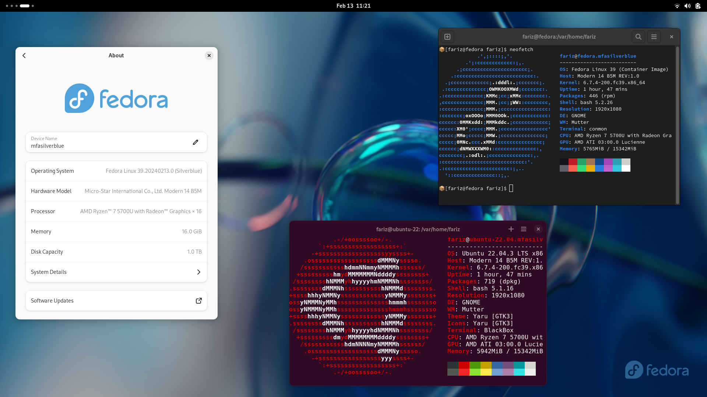

# My Fedora Silverblue

This is my documentation on how to setup my fedora silverblue.

## Folder

* **custom_container_images** : my custom-image container

## File

* **baseimage_modificatoin.sh** : Modify OS base image. I switch Firefox from the rpm-ostree to Firefox from Flathub

* **swap_fedora_flatpak_wflathub.sh** : Swao all Flatpak app from fedora flatpak repo to Flathub to get more uptodate software

* **install_flathub.sh** : to install all of my daily applications from flathub repo


## Screenshot




## Host OS Setup

* do base image modification

    ```
    $ bash baseimage_modification.sh
    ```

* swap flatpak from fedora flatpak with flatpak from flathub (optional)

    ```
    $ bash swap_fedora_flatpak_wflathub.sh
    ```

* install flathub

    ```
    $ bash install_flathub.sh
    ```


## Container Setup

### Work

Contianer Podman for work purpose

* build custom image
    ```
    $ podman build -t ubuntu-22.04 -f custom_container_images/Dockerfile.ubuntu
    ```

* create distrobox with custom home directory
    ```
    $ distrobox create --name ubuntu-22.04 --image localhost/ubuntu-22.04:latest --home ~/distrobox/ubuntu-22.04
    ```

* enter the container
    ```
    $ distrobox enter ubuntu-22.04
    ```

* inside container, export visual studio code to the host
    ```
    $ distrobox-export --app code
    ```

### Testing package

Container for testing new package in fedora

* build custom image
    ```
    $ podman build -t fedora -f custom_container_images/Dockerfile.fedora
    ```

* create distrobox with custom home directory
    ```
    $ distrobox create --name fedora --image localhost/fedora:latest --home ~/distrobox/fedora
    ```

* enter the container
    ```
    $ distrobox enter fedora
    ```


## Notes

Reference:

* <https://containertoolbx.org/install/>
* <https://github.com/89luca89/distrobox/blob/main/docs/README.md>
* <https://github.com/toolbx-images/images>